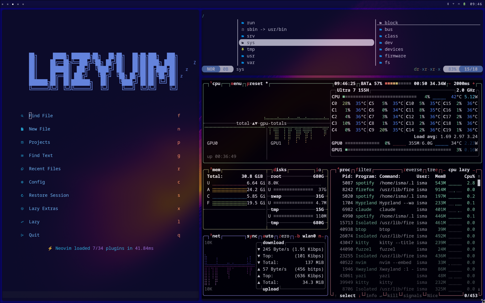
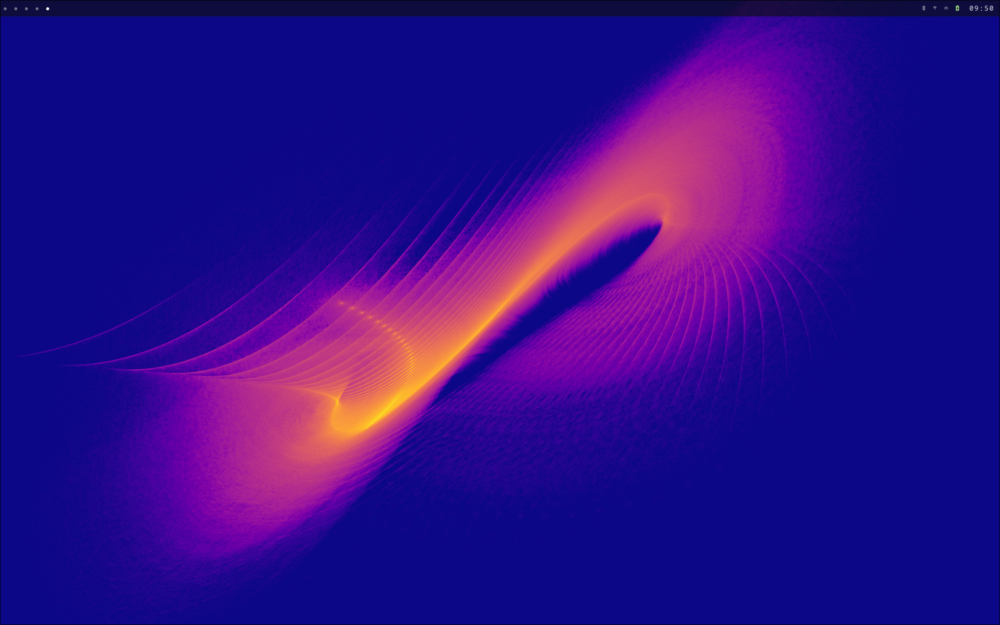

# AW-Dotfiles

Personal dotfiles for my **Alienware m16 R2** running **CachyOS Linux**.  
Configured for a fast, minimal, keyboard-driven Wayland desktop.




---

## Hardware

| Component | Spec |
|-----------|------|
| **Machine** | Alienware m16 R2 |
| **CPU** | Intel Core Ultra 7 155H |
| **GPU** | NVIDIA GeForce RTX 4050 Mobile + Intel Arc (iGPU) |
| **RAM** | 32 GB |
| **Display** | 16" — scaled at 1.6x (HiDPI) |

---

## Software Stack

| Role | Tool | Why |
|------|------|-----|
| **OS** | [CachyOS](https://cachyos.org) | Arch-based with BORE scheduler and kernel patches tuned for the Core Ultra 7 155H's three-tier core topology (P + E + LP-E cores). Vanilla Arch works, but scheduling is noticeably worse under mixed workloads |
| **Compositor** | [Hyprland](https://hyprland.org) | Wayland-native with first-class NVIDIA support via explicit sync. X11 compositors had tearing and sync issues with the RTX 4050 on this panel |
| **Shell** | [Fish](https://fishshell.com) | |
| **Prompt** | [Starship](https://starship.rs) | |
| **Terminal** | [Kitty](https://sw.kovidgoyal.net/kitty) | GPU-accelerated rendering — offloads terminal drawing to the RTX 4050, noticeably faster with large outputs or heavy tmux layouts |
| **Editor** | [Neovim](https://neovim.io) + [LazyVim](https://lazyvim.org) | |
| **Bar** | [Waybar](https://github.com/Alexays/Waybar) | |
| **File Manager** | [Yazi](https://github.com/sxyazi/yazi) | |
| **Multiplexer** | [Tmux](https://github.com/tmux/tmux) | |
| **System Monitor** | [Btop](https://github.com/aristocratos/btop) | |
| **App Launcher** | [Fuzzel](https://codeberg.org/dnkl/fuzzel) | Pure Wayland — no XWayland dependency, faster cold start than rofi/wofi |
| **Navigation** | [Zoxide](https://github.com/ajeetdsouza/zoxide) | |

---

## Structure

```
.config/
├── hypr/                          # Hyprland compositor (Lua config + scripts)
│   ├── hyprland.lua               # Main config
│   ├── hyprlock.conf              # Lock screen
│   ├── hypridle.conf              # Idle daemon
│   └── scripts/                   # Custom shell scripts
├── pipewire/filter-chain.conf.d/  # PipeWire speaker EQ (9-band LV2 + limiter)
├── wireplumber/                   # WirePlumber default sink routing
├── waybar/                        # Status bar config + CSS
├── fish/                          # Shell config
├── nvim/                          # Neovim (LazyVim-based)
├── kitty/                         # Terminal emulator
├── tmux/                          # Terminal multiplexer
├── yazi/                          # Terminal file manager
├── fastfetch/                     # System info display
├── btop/                          # Resource monitor
└── starship.toml                  # Shell prompt

system/
└── alienware-fan/
    ├── alienware-fan              # Fan + CPU governor daemon
    └── alienware-fan.service      # systemd service
```

---

## Audio Tuning

Custom **9-band parametric EQ** via PipeWire + LSP LV2 plugins (`para_equalizer_x16_stereo`), tuned specifically for the Alienware m16 R2's side-firing 2W speakers.

### Why these speakers need EQ

The m16 R2 drivers are side-firing, aimed at the desk surface rather than your face. This creates three physical problems:

1. **They can't reproduce sub-bass** — the drivers are too small. Without a cut, they distort and waste power trying to reproduce frequencies they can't, with no audible result.
2. **The plastic enclosure colors the sound** — cheap laptop cabinets resonate at specific frequencies (~180–400 Hz), producing the "tinny" or "boxy" character typical of laptop speakers.
3. **The side angle kills air and presence** — high frequencies are directional. Pointed at the desk, they arrive at your ears attenuated compared to a front-facing speaker.

### Band decisions

| Band | Type | Freq | Gain | Reason |
|------|------|------|------|--------|
| 0 | Lo-shelf | 80 Hz | −3.5 dB | Conservative cut — the driver has some energy here, so a shelf (not a hard cut) protects without sounding thin |
| 1 | Bell | 130 Hz | +2.5 dB | Where the driver actually has physical energy; boosting here adds weight without pushing the driver out of its safe range |
| 2 | Bell | 180 Hz | −1.5 dB | Cabinet resonance — the box itself rings here, creating a "boomy" one-note bass |
| 3 | Bell | 380 Hz | −1.5 dB | Nasal coloration from the plastic enclosure; cut separately from 180 Hz because it has a different Q |
| 4 | Bell | 2500 Hz | +1.5 dB | The presence region — where the brain perceives clarity. Side-firing loses it; boosting here puts voices and instruments back in front of you |
| 5 | Bell | 5000 Hz | −2.0 dB | Lateral drivers create artificial sibilance around 5 kHz as the signal bounces off surfaces; cutting reduces listening fatigue |
| 6 | Bell | 6500 Hz | −1.0 dB | Smooth bridge between the 5k cut and the hi-shelf — without this the shelf would create an abrupt, unnatural peak |
| 7 | Hi-shelf | 8000 Hz | +3.5 dB | The most aggressive boost: everything above 8 kHz is heavily attenuated by the side angle; without this the sound is dull and closed-in |
| 8 | Bell | 12000 Hz | +1.5 dB | Restores high-end shimmer; at 12k desk reflections no longer interfere, so it can be boosted without sounding harsh |

**Preamp: −4.5 dB** — the boosts add gain. Pulling down the input first gives the boosts room to push without the signal clipping before the limiter.

**Stereo limiter: −2 dB threshold, 50 ms release** — hardware safety net. At max volume the system can demand more power than 2W drivers can handle. The limiter clips peaks before they reach the driver; the 50 ms release avoids audible pumping on music.

Config: `.config/pipewire/filter-chain.conf.d/speakers-eq.conf`

---

## Fan & CPU Control

Custom systemd daemon (`system/alienware-fan/`) that manages ACPI platform profiles and CPU energy performance preferences based on power source and thermal state. Polls every 5 seconds.

### Manual modes (set via Waybar buttons)

| Mode | ACPI Profile | EPP | Governor |
|------|-------------|-----|----------|
| `low` | quiet | power | powersave |
| `normal` | balanced-performance | balance_power | powersave |
| `gaming` | performance | performance | performance |

### Thermal protection — sustained gaming

The daemon includes an emergency mode designed specifically for sustained gaming loads where the CPU stays hot for extended periods:

- If CPU temperature stays **≥ 80°C for 45 consecutive seconds** → forces `performance` profile + `performance` EPP + `performance` governor, overriding whatever mode was selected
- Emergency mode exits only when temperature drops to **≤ 72°C** (8°C hysteresis to prevent oscillation between states)

The logic exists because gaming mode alone isn't always enough: the ACPI `performance` profile tells the firmware to spin fans up, but if the game is running a fixed workload the thermal envelope can still saturate. The emergency trigger acts as a second enforcement layer — it re-applies the profile and governor at the OS level, which can break the saturation cycle.

The 45-second delay avoids false positives from burst loads (compilation, shader compilation at game launch) that spike temperature briefly then cool on their own.

### Battery behavior

On battery the daemon overrides the user-selected mode silently:

| Condition | Forced to |
|-----------|-----------|
| Gaming mode selected on battery | Downgraded to `normal` (balanced-performance / balance_power) |
| Screen locked (hyprlock active) | `quiet` / `power` — minimal draw while idle |
| Any other mode on battery | Respected as-is |

Gaming mode is downgraded on battery because `performance` EPP + governor with no AC means the CPU will drain the battery in minutes and throttle anyway once voltage drops — so it's pointless and damaging to battery longevity.

### Install

```bash
sudo cp system/alienware-fan/alienware-fan /usr/local/bin/
sudo chmod +x /usr/local/bin/alienware-fan
sudo cp system/alienware-fan/alienware-fan.service /etc/systemd/system/
sudo systemctl enable --now alienware-fan
```


---

## Notable Scripts

| Script | Description |
|--------|-------------|
| `hypr/scripts/backup-configs.sh` | Auto-backup configs on session start, keeps last 7 snapshots |
| `hypr/scripts/live-stats.sh` | Real-time CPU, RAM, GPU, battery stats in terminal |
| `hypr/scripts/dashboard.sh` | Tmux dashboard with clock, stats and audio visualizer |
| `hypr/scripts/wallpaper-cycle.sh` | Wallpaper rotation with pywal color reload |
| `hypr/scripts/zen-mode.sh` | Toggle Waybar on/off for distraction-free mode |
| `hypr/scripts/battery-notify.sh` | Battery level notifications |
| `waybar/fan-mode.sh` | Alienware fan mode switcher |
| `waybar/power-profile.sh` | Power profile switcher (performance/balanced/saver) |

---

## Hyprland Config

Written in **Lua** via `hyprland.lua` — avoids repetition and allows programmatic keybind and workspace definitions. Falls back to standard `hyprland.conf` for compatibility.

Monitor is configured at **1.6x scale** for HiDPI (1.5x caused rendering artifacts on this panel).

---

## Wallpaper

[Wallhaven — 1qg3q9](https://wallhaven.cc/w/1qg3q9) — Licensed CC0 (public domain)

Wallpapers are **not included** in this repo. All images remain property of their original owners.

---

## Installation

> These are personal configs — install selectively, not blindly.

```bash
git clone https://github.com/Ismael-RB/AW-Dotfiles.git
cd AW-Dotfiles

# Copy what you need, e.g.:
cp -r .config/hypr ~/.config/
cp -r .config/fish ~/.config/
cp .config/starship.toml ~/.config/
```
